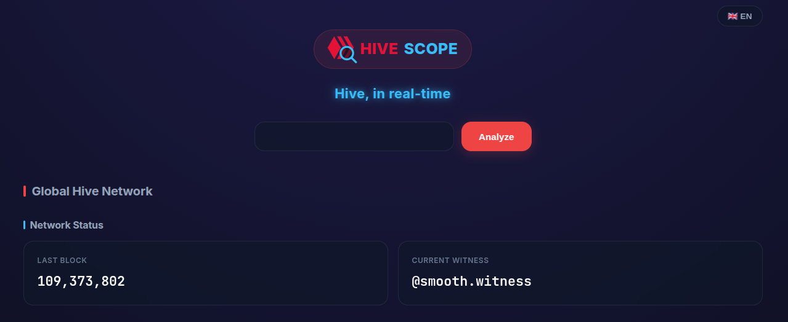

# hive-scope


Hive stats in real-time.

🔗 Live: [hivescope.xyz](https://hivescope.xyz)



## Description

`hive-scope` is a web app that shows Hive blockchain stats in real-time — global network metrics and per-account analysis — with no backend of its own: everything is fetched client-side directly from public Hive RPC nodes.

## Features

- **Global network stats**: last block, current witness, HIVE price, supply, staking ratio, reward pool, HBD print rate, DAO fund, and more.
- **Account analysis**: HP breakdown (own/received/delegated), voting mana, vote value (current mana and 100% estimate), reputation, pending rewards, Resource Credits, followers, and portfolio value.
- **Filterable activity history**: recent account activity, filterable by transfers, posts, votes, rewards, or other.
- **Automatic node failover**: requests retry across a list of public Hive nodes if one fails.
- **Bilingual UI**: English and Spanish, switchable at runtime.

## Project structure

```
hive-scope/
├── index.html   # Application entry point
└── app.js       # Main application logic
```

## Usage

Since this is a static project (HTML + JS), you can run it locally by serving the files with any static server, for example:

```bash
npx serve .
```

or simply by opening `index.html` in your browser.

## Status

Actively maintained, early-stage project.

## License

MIT. See [LICENSE](./LICENSE) for details.
